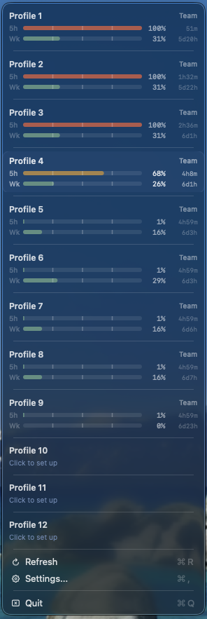

# codex-profile-switcher

Tiny macOS 14+ menu bar app that manages **multiple OpenAI Codex accounts** and shows per-profile usage. Switch profiles without logging in again, track the quota windows Codex reports with reset countdowns. Auth stored in macOS Keychain. No Dock icon, no main window, just a menu bar dropdown.

[](https://github.com/4LAU/codex-profile-switcher/releases/latest)
[](https://github.com/4LAU/codex-profile-switcher/releases/latest)
[](https://github.com/4LAU/homebrew-tap)
[](LICENSE)



## Why

- You have multiple Codex accounts (personal, work, client). Logging out and back in every time is painful. This app makes switching instant.
- Usage limits reset on rolling windows, and you can't see them for inactive accounts. This app tracks every saved profile, not just the active one.
- Auth lives in macOS Keychain. No telemetry, no cloud sync, no account linking.

## Features

- Manage multiple saved Codex profiles with custom labels
- See each quota window Codex reports for a saved profile, with its actual duration
- Show credit balance when Codex exposes it
- Switch accounts without logging in every time
- Refresh inactive OAuth profiles so usage data stays current
- Keep the last known usage snapshot in the menu
- Launch at login
- Copy redacted debug info, open the log file, and jump to the GitHub issue form

## Privacy

The app reads and writes macOS Keychain items it creates, `~/.codex/auth.json`, and its own config at `~/.codex-switcher/config.json`. It does not read browser data, does not access files outside those paths, and does not send telemetry or phone home. All data stays on your machine.

## Install

Requires macOS 14+ and the [Codex desktop app](https://openai.com/codex/).

### GitHub Releases

Download the latest signed and notarized DMG from
[GitHub Releases](https://github.com/4LAU/codex-profile-switcher/releases), open
it, and drag `CodexProfileSwitcher.app` to Applications.

### Homebrew

Install via the [4lau/tap](https://github.com/4LAU/homebrew-tap):

```bash
brew install --cask 4lau/tap/codex-profile-switcher
```

### Build from Source

Building from source requires Xcode.app. The test and package scripts use SwiftPM targets under `Sources/` and set `DEVELOPER_DIR=/Applications/Xcode.app` when available.

```bash
git clone https://github.com/4LAU/codex-profile-switcher.git
cd codex-profile-switcher

./build.sh

# Start the loose app with an isolated home
CODEX_PROFILE_HOME="$HOME/.codex-profile-dev" codex-profile-switcher
```

The menu bar app is installed to `~/.local/bin/codex-profile-switcher`, and the
matching Swift CLI helper is installed to `~/.local/bin/codex-profile`.

**No Keychain prompts for source builds.** Released app bundles use the macOS
Data Protection Keychain, which lets the signed app and its bundled helper read
their shared saved profiles without per-account access-control prompts. Self-built
binaries never touch the real Keychain. When launching the loose menu app, set
`CODEX_PROFILE_HOME` or `CODEX_PROFILE_TEST_HOME` to a separate directory, as
shown above. The app stores its config and Codex data under that directory and
uses a file-based vault at `<home>/.codex-switcher/dev-auth-store` (0600 files,
the same protection Codex itself uses for `~/.codex/auth.json`). Without an
isolated home, the loose app hands startup to the signed app in `/Applications`
instead of opening production profile data. No Apple account or certificate is
needed, and no prompts appear. To build a CLI that shares the
real Keychain profiles, sign it with any Apple certificate:

```bash
make install-cli APP_IDENTITY="Apple Development: you@example.com (TEAMID)"
```

The helper finds the installed Codex Desktop bundle by its `com.openai.codex`
bundle identifier. This supports the current ChatGPT.app layout and the legacy
Codex.app layout. Set `CODEX_APP`, `CODEX_CLI`, or `CODEX_BUNDLED_CLI` when you
need to use an explicit installation or test fixture.

To build a signed app bundle instead of loose binaries:

```bash
Scripts/package_app.sh

# Optional Developer ID / Apple Development identity.
APP_IDENTITY="Developer ID Application: Your Name (TEAMID)" Scripts/package_app.sh
```

Maintainer releases should use the DMG release flow in [docs/RELEASING.md](docs/RELEASING.md).

## Getting Started

Each profile needs one login before the app can switch to it.

Open Settings from the menu bar icon, select a profile, and click **Set Up**.
This opens Codex's normal browser login flow and saves the resulting auth in
macOS Keychain. After that, switching does not require logging in again.

You can also set up profiles from the terminal:

```bash
codex-profile login 1
codex-profile login 2
```

## Refresh

Open **Settings...** > **General** to choose how often the app refreshes usage:
**Manual**, **1 minute**, **2 minutes**, **5 minutes**, or **15 minutes**. The
default is 5 minutes. Manual turns off periodic refreshes only. You can still
refresh from the menu, and the normal launch, activation, wake, and profile
change refreshes still run.

**Refresh when the menu opens** is off by default. Turn it on if opening the
menu should also request fresh usage.

Choose **Refresh** or press Command-R to update the open menu in place. The
menu stays open and the Refresh row is disabled until the work finishes. If a
refresh cannot get a current reading, the last successful reading stays visible
with an amber **Cached** marker.

## CLI Reference

The `codex-profile` helper manages profiles from the terminal.

```
codex-profile app <profile> [workspace]
codex-profile login <profile> [codex-login-args...]
codex-profile status [profile] [--json]
codex-profile list [--json]
codex-profile path <profile>
codex-profile doctor
codex-profile best-auth --dir <path> [--exclude <id1,id2,...>] [--json] [--non-interactive] [--timeout <seconds>]
codex-profile exec [--max-attempts <n>] [--exclude <id1,id2,...>] [--timeout <seconds>] -- <command> [args...]
codex-profile import-auth --dir <path> --profile <id> [--non-interactive] [--timeout <seconds>]
codex-profile lease begin [--exclude <id1,id2,...>] [--ttl <seconds>] [--timeout <seconds>] [--json] [--non-interactive]
codex-profile lease swap <token> [--exclude <id1,id2,...>] [--ttl <seconds>] [--timeout <seconds>] [--json] [--non-interactive]
codex-profile lease end <token> [--profile <id>] [--timeout <seconds>] [--non-interactive]
codex-profile lease gc
```

**Core commands**

- `login` — runs an isolated Codex login and saves the resulting auth to the Keychain.
- `app` — switches to a profile and relaunches Codex Desktop.
- `status` — shows auth state for one or all profiles. `--json` emits a JSON array.
- `list` — lists known profiles. `--json` emits a JSON array.
- `path` — prints the Keychain location for a profile.
- `doctor` — prints environment, installed Codex binaries, auth backend, and profile status.

### best-auth

Selects the profile with the most remaining quota and writes its credentials to `--dir`. Designed for scripted account rotation with `codex exec --ephemeral`.

Fetches live usage via `codex app-server` (bounded concurrency of 3) before ranking. Falls back to each profile's cached snapshot when a live fetch fails. Stores fresh snapshots back to the cache.

**Non-interactive behavior.** When stdin is not a terminal (CI, command substitution, cron), or when `--non-interactive` is passed, Keychain reads that would show a modal consent prompt are skipped instead of blocking. A global watchdog exits the process after `--timeout` seconds (default 30) to guarantee termination.

**Basic usage — bare profile ID on stdout:**

```bash
# Use in command substitution
PROFILE=$(codex-profile best-auth --dir /tmp/codex-session)
codex exec --ephemeral --dir /tmp/codex-session -- your-command
```

**JSON output:**

```bash
codex-profile best-auth --dir /tmp/codex-session --json
```

```json
{"candidates":[{"id":"personal","score":21,"snapshotAgeSeconds":47,"tier":"preferred"},{"id":"work","score":18,"snapshotAgeSeconds":14,"tier":"preferred"}],"fetched":true,"score":18,"selected":"work","tier":"preferred"}
```

**Excluding profiles:**

```bash
# Exclude a profile known to be rate-limited
codex-profile best-auth --dir /tmp/codex-session --exclude work
```

**Exit codes:**

| Code | Meaning |
|------|---------|
| 0 | Profile selected and credentials written |
| 1 | Generic failure |
| 2 | No eligible profile (all excluded or exhausted) |
| 3 | No profiles configured |
| 4 | Usage data unavailable (no live fetch succeeded, no cached snapshots) |
| 6 | Keychain interaction required — run `codex-profile best-auth` once from a terminal to grant access |
| 7 | Watchdog timeout |

### exec

Runs any command with `CODEX_HOME` pointed at the best profile's credentials, with automatic rotation on usage limits. This is the one-line replacement for hand-rolled `best-auth` / `mark-exhausted` / `import-auth` loops:

```bash
codex-profile exec -- codex exec --ephemeral -C "$(pwd)" - < prompt.md
```

Per attempt (up to `--max-attempts`, default 3):

1. Selects the profile with the most remaining quota (same logic and exit codes as `best-auth`) into a private temp directory.
2. Runs the command with `CODEX_HOME` pointing there. stdin and stdout pass through untouched; stderr passes through and is also scanned.
3. On success, writes refreshed tokens back to the profile (identity-guarded) and exits 0.
4. If the command failed and its stderr matches a usage-limit error (`rate limit`, `usage limit`, `429`, `quota exceeded`, `too many requests`), the profile is marked exhausted for an hour and the command retries on the next best profile. Any other failure exits immediately with the child's exit code. Detection scans stderr only — a limit message printed exclusively to stdout is not detected, because stdout streams through verbatim.

The live `~/.codex` is never touched, so a running Codex Desktop/CLI session is unaffected. Selection failures use the `best-auth` exit codes (2/3/4/6); a selection watchdog (`--timeout`, default 60s) covers only the selection phase, never the wrapped command.

### import-auth

Writes a refreshed `auth.json` from `--dir` back to the stored credential for `--profile`. Intended as the write-back half of a `best-auth` rotation loop — or just use `exec`, which does the full loop for you.

**Identity guard.** Before overwriting, `import-auth` compares the identity fingerprint of the existing stored credential against the incoming file. If they belong to different accounts the write is refused and the command exits 5. This prevents a credential for one account from silently overwriting a different account's profile.

**Headless mode.** `--non-interactive` skips the interactive Keychain-repair step, which can otherwise stall a headless process on a modal consent prompt, and reads the existing credential through the fail-closed vault. `--timeout <seconds>` arms a watchdog so the call always terminates. This is the write-back path `lease end` uses.

```bash
codex-profile import-auth --dir /tmp/codex-session --profile work
```

Exit code 5 means the refreshed credential belongs to a different account. All other failures exit 1.

### lease

`exec` wraps a single command. When you need one Codex session to stay open across many turns (an agent loop, a long review), `lease` holds an account open and rotates it underneath the session when a limit hits, so the session never restarts and never re-reads the repo.

```bash
read -r CHOME TOKEN < <(codex-profile lease begin --json | jq -r '"\(.home) \(.token)"')
export CODEX_HOME="$CHOME"
trap 'codex-profile lease end "$TOKEN"' EXIT

cd "$REPO"
codex exec -C "$REPO" - < prompt.md          # first turn reads the repo

# ...a usage limit hits mid-session...
codex-profile lease swap "$TOKEN"            # next-best account, same home
codex exec resume --last - < followup.md     # still warm, no repo re-read
```

- `begin` — reserves the profile with the most remaining quota (same logic and exit codes as `best-auth`), seeds a private throwaway `CODEX_HOME`, and records the reservation so a second run never grabs the same account. Prints the home path, or `{profile, home, token, expires_at}` with `--json`. The reservation lasts `--ttl` seconds (default 3600), a backstop in case the process dies without releasing it.
- `swap <token>` — the leased account hit a limit. `swap` writes its refreshed credential back, marks it exhausted for an hour, and drops the next-best account into the same home. The session files under `sessions/` are left alone, so a `codex exec resume` stays warm.
- `end <token>` — writes the refreshed credential back to its profile and tears the lease down. It is idempotent and trap-safe: wire it to a shell `trap` and a second call, or a call after the work already finished, is a clean no-op. Pass `--profile <id>` to assert the lease still belongs to the account you expect before writing.
- `gc` — deletes expired lease homes and reclaims any home a crashed run left behind. `begin` calls it opportunistically, so you rarely run it yourself.

Reservations live in the shared usage cache, and any account holding one is skipped by `best-auth`, `exec`, and other `lease begin` calls. Every write to that cache goes through a cross-process lock, so two agents reserving and releasing accounts at the same moment cannot drop each other's reservations or strand a refreshed credential.

`--non-interactive` and `--timeout` behave as they do for `best-auth`: skip Keychain prompts that would block a headless run, and guarantee the call exits. Selection exit codes match `best-auth` (2 no eligible profile, 3 no profiles configured, 4 usage unavailable, 6 keychain interaction required).

## How It Works

Codex Desktop still runs against its normal `~/.codex/` directory. This project
stores per-profile auth in macOS Keychain and swaps the selected profile into
`~/.codex/auth.json` when you switch.

When you switch profiles, the helper:

1. Quits the running Codex instance
2. Saves the outgoing live auth back to the matching stored profile
3. Restores the selected profile's saved auth to `~/.codex/auth.json`
4. Relaunches Codex normally

For usage data, the app fetches quota via `codex app-server` in a temporary
profile-scoped environment. The same path is used by the CLI's `best-auth`
command when it self-fetches usage before ranking.

## macOS Permissions

The app stores auth tokens in the Data Protection Keychain. Signed releases use
an Apple-authorized storage group shared by the app and bundled helper, so
ordinary profile switches do not need a per-account Keychain approval prompt.

After upgrading from an older release, open Settings > General and review any
legacy Keychain copies before moving them. The app lists the affected profiles
and does not remove the old copies unless you confirm that exact list.

## Troubleshooting

Open `Settings...` > `General` for built-in support tools:

- Copy Debug Info copies app state plus recent redacted logs to the clipboard.
- Open Log opens `~/Library/Logs/CodexProfileSwitcher/CodexProfileSwitcher.log`.
- Report Bug opens the GitHub issue form.

Logs redact emails, bearer tokens, cookies, API keys, and OAuth fields before writing. From the terminal, `codex-profile doctor` prints a quick environment and saved-profile check.

## Docs

- [CHANGELOG.md](CHANGELOG.md) — release history
- [AGENTS.md](AGENTS.md) — project structure, build commands, contribution guidelines
- [SECURITY.md](SECURITY.md) — vulnerability reporting
- [docs/architecture.md](docs/architecture.md) — system design overview
- [docs/DEVELOPMENT.md](docs/DEVELOPMENT.md) — development setup and workflow
- [docs/repo-boundaries.md](docs/repo-boundaries.md) — source ownership and generated-path boundaries
- [docs/RELEASING.md](docs/RELEASING.md) — maintainer release process

## Credits

Auth and usage API patterns adapted from [CodexBar](https://github.com/steipete/codexbar) by Peter Steinberger.
The persistent refresh interaction pattern was adapted from audited CodexBar
commit [`c61e01e774c449b06324a1cc260af7c77cf17d47`](https://github.com/steipete/CodexBar/commit/c61e01e774c449b06324a1cc260af7c77cf17d47).
See [THIRD_PARTY_NOTICES.md](THIRD_PARTY_NOTICES.md) for the license notice.

## License

MIT
